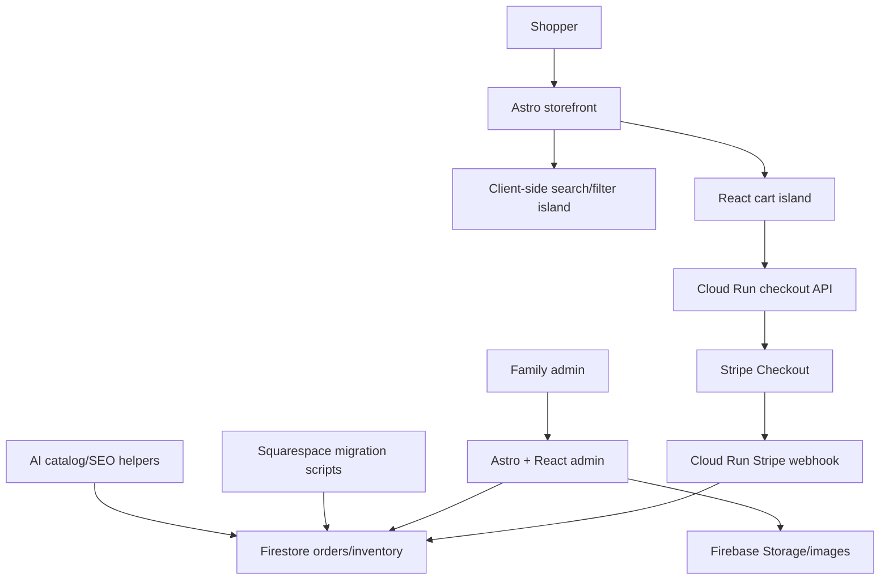

# Brooklynite Designs Rebuild - Draft Technical Design

**Status:** Draft  
**Owner:** Brooklynite Designs  
**Last updated:** 2026-05-28  
**Source site:** https://www.brooklynitedesigns.com/  
**Target repo:** `teddy-tennisnomad/brooklynite-designs`

## 1. Executive Summary

Brooklynite Designs is a family-run ecommerce business selling Brooklyn-inspired apparel, baby gifts, hats, knits, art, and accessories. Inventory is stored in-house, garments are ordered and printed through a Brooklyn shop, and orders are fulfilled directly by the family.

This rebuild should preserve the warmth of the current Squarespace store while replacing the ecommerce experience with a faster, more searchable, more SEO-focused custom site using the same core stack as the Manhattan Tennis Association project:

- Astro for page rendering and content structure
- React islands for interactive shopping/admin features
- TypeScript for shared types
- Tailwind CSS for styling
- Firebase/Firestore for product, order, customer, and inventory data
- Firebase Hosting + Cloud Run for deployment and API execution

The first version should avoid a fully custom payment system. Use Stripe Checkout for payments so the site never directly handles card data and the family can focus on catalog, inventory, fulfillment, and customer service.

## 2. Goals

### Business Goals

- Rebuild the store from scratch with a polished, trustworthy ecommerce experience.
- Make the family-run, printed-in-Brooklyn story visible throughout the site.
- Improve organic search traffic through collection pages, product SEO, structured data, and editorial content.
- Make product discovery easier with search, filtering, sorting, and gift-oriented collections.
- Keep operations lightweight enough for a family business run primarily by one person.
- Preserve existing SEO value from Squarespace through URL mapping and 301 redirects.

### Customer Experience Goals

- Help shoppers quickly find products by recipient, category, size, style, and theme.
- Make product pages answer common purchase questions before checkout.
- Make the store feel local, personal, and credible rather than generic.
- Support mobile-first browsing and checkout.
- Reduce uncertainty around shipping, returns, sizing, stock, and fulfillment timing.

### Technical Goals

- Use an Astro-first architecture similar to MTA.
- Keep most pages static or pre-rendered for speed and SEO.
- Use React only where interactivity is needed.
- Use Stripe Checkout for PCI-safe payments.
- Use Firestore as the operational source of truth for products, inventory, orders, and admin data.
- Support automated product copy, metadata, alt text, and collection tagging workflows.
- Create a maintainable path for future features such as reviews, bundles, back-in-stock alerts, and wholesale inquiries.

## 3. Non-Goals For MVP

- Building a custom payment form.
- Building a marketplace or multi-vendor system.
- Building a complex warehouse management system.
- Real-time production integrations with the Brooklyn print shop.
- Customer accounts as a launch blocker.
- Full headless Shopify integration.
- International shipping logic beyond simple rules.

## 4. Recommended Stack

### Frontend

- **Astro 5:** Static-first pages, content collections, SEO-friendly routing.
- **React 19 islands:** Cart drawer, product option selectors, filters, search, admin screens.
- **Tailwind CSS:** Design system and responsive layout.
- **TypeScript:** Shared product, cart, inventory, order, and SEO types.
- **Lucide React:** Icons for actions, filters, cart, account, search, and admin controls.

### Backend

- **Firebase Hosting:** Serves the Astro build.
- **Cloud Run:** Hosts API endpoints for checkout, Stripe webhooks, admin actions, AI jobs, migration tooling, and image processing if needed.
- **Firestore:** Primary operational database.
- **Firebase Auth:** Admin login for family/admin workflows.
- **Firebase Storage:** Product images and generated assets, unless images are committed to `public/images` for launch simplicity.
- **Stripe Checkout:** Payments, tax options, Apple Pay/Google Pay, hosted checkout, refunds, and payment reporting.
- **Resend:** Transactional and marketing-adjacent emails, matching the MTA pattern.

### Deployment

The repo README currently calls for Firebase Hosting + Cloud Run. MTA's checked-in project uses Astro/Tailwind/React and Cloudflare/Wrangler in production, but the Brooklynite repo should proceed with the Firebase target unless deployment direction changes. The frontend remains portable because the Astro app should avoid provider-specific code in page components.

## 5. High-Level Architecture



## 6. Site Map

### Storefront Routes

- `/` - Homepage
- `/collections` - Collection index
- `/collections/[slug]` - SEO collection pages
- `/products/[slug]` - Product detail pages
- `/search` - Search results
- `/cart` - Cart page fallback for non-drawer checkout
- `/checkout/start` - Server-driven checkout redirect
- `/about` - Family story and Brooklyn production story
- `/shipping-returns` - Shipping, exchanges, returns, gift policies
- `/contact` - Contact form, email, response expectation
- `/faq` - Buying, sizing, shipping, care, returns
- `/journal` - Editorial index
- `/journal/[slug]` - SEO articles and gift guides
- `/wholesale` - Optional wholesale inquiry page

### Admin Routes

- `/admin` - Dashboard
- `/admin/products` - Product management
- `/admin/products/[id]` - Product edit screen
- `/admin/inventory` - Basement inventory view
- `/admin/orders` - Order queue
- `/admin/orders/[id]` - Order detail and fulfillment notes
- `/admin/collections` - Collection management
- `/admin/seo` - Metadata and redirect review
- `/admin/migration` - Import/export tools

## 7. Product Discovery Model

The current Squarespace catalog should be reorganized around how customers shop:

- **Recipient:** Baby, Kids, Women, Men, Everyone
- **Category:** T-shirts, Bodysuits, Hats, Knits, Bibs, Art, Gifts
- **Theme:** Brooklyn Bridge, Brooklyn Dodgers-inspired, Neighborhoods, Subway/NYC, Vintage Brooklyn
- **Use case:** Baby shower gifts, Brooklyn gifts, New arrivals, Best sellers, Under $30, Handmade knits
- **Status:** In stock, Low stock, Made to order, Sold out, Retired

Every collection page should support:

- Sort by featured, newest, best-selling, price low-high, price high-low
- Filter by recipient, category, size, color, price, status, and theme
- Short SEO intro copy
- Internal links to adjacent collections
- Collection-level structured data

## 8. Product Page Requirements

Each product page should include:

- Product title
- Price
- Image gallery with zoom-ready images
- Variant selectors for size, color, garment, and style
- Stock status and fulfillment note
- Add to Cart
- Stripe-supported accelerated checkout through Checkout
- Short sales description
- Product details
- Materials
- Care instructions
- Size guide
- Shipping and returns summary
- "Printed locally in Brooklyn" or "Handmade" trust marker when applicable
- Related products
- Recently viewed products
- Reviews placeholder or imported testimonials after launch
- Product JSON-LD schema

## 9. Data Model

### `products`

```ts
type Product = {
  id: string;
  slug: string;
  title: string;
  subtitle?: string;
  descriptionShort: string;
  descriptionLong: string;
  status: 'active' | 'draft' | 'sold_out' | 'retired';
  productType: 'tshirt' | 'bodysuit' | 'hat' | 'knit' | 'bib' | 'art' | 'accessory';
  recipient: Array<'baby' | 'kids' | 'women' | 'men' | 'everyone'>;
  themes: string[];
  tags: string[];
  images: ProductImage[];
  variants: ProductVariant[];
  seo: SeoFields;
  createdAt: string;
  updatedAt: string;
};
```

### `productVariants`

Variants may be embedded on products for read performance, with a separate inventory collection for operational updates.

```ts
type ProductVariant = {
  id: string;
  sku: string;
  title: string;
  size?: string;
  color?: string;
  garment?: string;
  priceCents: number;
  compareAtPriceCents?: number;
  stripePriceId?: string;
  inventoryPolicy: 'deny' | 'continue' | 'made_to_order';
  active: boolean;
};
```

### `inventory`

```ts
type InventoryItem = {
  sku: string;
  productId: string;
  variantId: string;
  quantityOnHand: number;
  quantityReserved: number;
  reorderPoint: number;
  basementLocation?: string;
  printShopReorderNotes?: string;
  updatedAt: string;
};
```

### `orders`

```ts
type Order = {
  id: string;
  stripeCheckoutSessionId: string;
  stripePaymentIntentId?: string;
  customerEmail: string;
  customerName?: string;
  status: 'pending_payment' | 'paid' | 'packing' | 'shipped' | 'cancelled' | 'refunded';
  items: OrderItem[];
  shippingAddress?: ShippingAddress;
  subtotalCents: number;
  shippingCents: number;
  taxCents: number;
  totalCents: number;
  trackingNumber?: string;
  giftMessage?: string;
  createdAt: string;
  updatedAt: string;
};
```

### `collections`

```ts
type Collection = {
  id: string;
  slug: string;
  title: string;
  description: string;
  heroImage?: string;
  rules?: CollectionRule[];
  manualProductIds?: string[];
  seo: SeoFields;
  sortOrder: number;
  active: boolean;
};
```

### `redirects`

```ts
type Redirect = {
  fromPath: string;
  toPath: string;
  statusCode: 301 | 302;
  source: 'squarespace' | 'manual';
};
```

## 10. Cart And Checkout

### MVP Cart

- Store cart state in local storage.
- Validate product and variant availability server-side before creating checkout.
- Recalculate prices server-side.
- Reserve inventory only after payment succeeds, unless oversell risk becomes a real issue.

### Checkout Flow

1. Shopper adds products to cart.
2. Cart posts line items to `POST /api/checkout/create-session`.
3. Cloud Run validates product IDs, variants, price, and stock.
4. Cloud Run creates a Stripe Checkout Session.
5. Shopper pays in Stripe Checkout.
6. Stripe sends webhook to `POST /api/stripe/webhook`.
7. Webhook creates/updates order in Firestore.
8. Webhook decrements inventory.
9. Confirmation email is sent via Stripe and/or Resend.
10. Admin order queue shows the order for packing and shipping.

### Payment And Compliance

- Use Stripe Checkout to avoid handling raw card details.
- Do not store card data in Firestore.
- Use signed Stripe webhooks.
- Keep API secrets only in Cloud Run/Firebase secret manager.

## 11. Admin Experience

The admin should be designed for low-friction family operations.

### MVP Admin Features

- Login with Firebase Auth.
- View orders by status.
- Mark orders as packing, shipped, cancelled, or refunded.
- Add tracking numbers.
- View low-stock products.
- Edit product copy, prices, status, tags, and SEO fields.
- Upload or replace product images.
- Export products/orders as CSV.
- Review migration issues.

### Future Admin Features

- Bulk product editor.
- AI product description generator.
- AI SEO title/meta generator.
- AI image alt text generator.
- Back-in-stock email queue.
- Purchase order/reprint checklist for the Brooklyn print shop.
- Simple wholesale inquiry CRM.

## 12. SEO Requirements

### Technical SEO

- Unique title and meta description per page.
- Canonical URL per page.
- Open Graph and Twitter metadata.
- Generated `sitemap.xml`.
- `robots.txt`.
- Product JSON-LD.
- Breadcrumb JSON-LD.
- Organization JSON-LD.
- Collection page metadata.
- 301 redirects from Squarespace URLs.
- Image alt text for every product image.
- Mobile-first responsive layout.
- Core Web Vitals budget.

### Collection SEO Strategy

Priority landing pages:

- Brooklyn baby clothes
- Brooklyn baby gifts
- Brooklyn t-shirts
- Brooklyn hats
- Brooklyn Bridge shirts
- Brooklyn gifts
- NYC baby gifts
- Handmade baby hats
- Brooklyn Dodgers-inspired apparel
- Gifts for Brooklyn natives

### Journal Content Strategy

The journal should support product discovery, not distract from it.

Launch candidates:

- Best Brooklyn Baby Gifts
- Why We Print Locally in Brooklyn
- A Short History of the Brooklyn Bridge
- Gift Guide for Brooklyn Natives
- How to Choose Baby Shower Gifts With a Brooklyn Story

## 13. Squarespace Migration Plan

### Inputs

- Squarespace product export CSV
- Product images
- Existing page URLs
- Existing collection/category URLs
- Existing article/history content
- Current shipping and returns copy
- Current product reviews/testimonials, if available

### Migration Steps

1. Export products from Squarespace.
2. Crawl the live site for product URLs, collection URLs, titles, prices, images, and descriptions.
3. Normalize product data into a migration spreadsheet.
4. Clean product titles and variant naming.
5. Assign products to the new taxonomy.
6. Generate draft SEO titles, meta descriptions, and image alt text.
7. Upload images to Firebase Storage or commit optimized launch images to `public/images/products`.
8. Import products, variants, inventory, and collections into Firestore.
9. Generate redirect rules from old Squarespace paths to new routes.
10. QA every migrated product before launch.

### Migration QA Checklist

- Product count matches source catalog.
- Every active product has at least one image.
- Every active product has price, SKU, status, and collection assignment.
- Every active product has a canonical slug.
- No duplicate slugs.
- Variant prices match source data.
- Old URLs redirect to the correct new pages.
- Sold-out and made-to-order states are accurate.

## 14. AI-Assisted Workflows

AI should reduce catalog and marketing labor without becoming the source of truth.

### Useful AI Jobs

- Product description rewrite.
- SEO title/meta generation.
- Image alt text generation.
- Collection assignment suggestions.
- Duplicate product detection.
- Missing attribute detection.
- Gift guide outlines.
- Blog draft generation.
- Customer-service FAQ draft generation.
- Monthly Search Console opportunity summary.

### Guardrails

- AI output should be saved as draft fields until reviewed.
- Do not auto-publish price, inventory, policy, or legal copy changes.
- Preserve the family voice; avoid generic marketplace copy.
- Keep a manual review step before publishing generated content.

## 15. Design System Direction

The design should feel like a polished Brooklyn boutique, not a generic apparel template.

### Principles

- Product-first layouts.
- Warm family-business storytelling.
- High contrast and readable typography.
- Dense but calm collection pages.
- Trust cues near buying decisions.
- Mobile-first product browsing.
- No overly decorative interfaces that make shopping harder.

### Core UI Components

- Header with search, cart, and collection navigation.
- Mobile drawer navigation.
- Product card.
- Product gallery.
- Variant selector.
- Quantity selector.
- Cart drawer.
- Collection filter sidebar/sheet.
- Sort menu.
- Breadcrumbs.
- Review/testimonial block.
- Trust strip.
- Email signup.
- Admin table.
- Admin form controls.

## 16. Performance Budget

- Lighthouse performance target: 90+ on key pages.
- Largest Contentful Paint: under 2.5s on broadband mobile.
- Cumulative Layout Shift: under 0.1.
- Product listing pages should avoid shipping large JavaScript bundles.
- Product filters should hydrate only the filtering island.
- Images should use responsive sizes and lazy loading.
- Hero images should be optimized and preloaded only when they are the LCP element.

## 17. Security And Privacy

- Admin routes require Firebase Auth.
- Firestore rules restrict writes to authenticated admins and backend service accounts.
- Stripe secrets live only in Cloud Run environment/secrets.
- Stripe webhook signature must be verified.
- Customer PII stored only when operationally necessary.
- No card data stored.
- Contact forms should include spam protection.
- Admin audit fields should track `createdBy`, `updatedBy`, and timestamps.

## 18. Observability

- Google Analytics 4 for traffic and ecommerce events.
- Google Search Console for SEO monitoring.
- Stripe dashboard for checkout/payment issues.
- Cloud Run logs for API errors.
- Firebase console for Firestore usage and auth.
- Optional Sentry for frontend/backend error tracking.

Key events:

- Product viewed
- Collection viewed
- Search performed
- Filter applied
- Add to cart
- Begin checkout
- Purchase completed
- Newsletter signup
- Contact form submitted

## 19. Testing Strategy

### Unit Tests

- Price formatting.
- Cart calculations.
- Product normalization.
- Collection rule matching.
- URL slug generation.
- Redirect generation.

### Integration Tests

- Checkout session creation.
- Stripe webhook handling.
- Inventory decrement after payment.
- Admin product update.
- Migration import validation.

### End-to-End Tests

- Browse collection, filter, view product, add to cart, start checkout.
- Search for a product.
- Admin login and product edit.
- Order moves from paid to shipped.

## 20. Phased Implementation Plan

### Phase 0 - Foundation

- Create Astro project scaffold.
- Configure TypeScript, Tailwind, React, linting, and tests.
- Configure Firebase Hosting + Cloud Run.
- Add base layout, metadata helpers, sitemap, and design tokens.

### Phase 1 - Catalog And Storefront MVP

- Define product/collection schemas.
- Build homepage, collection, product, cart, about, shipping/returns, contact, and FAQ pages.
- Implement client-side cart.
- Implement Stripe Checkout session creation.
- Implement Stripe webhook order creation.
- Add basic admin order view.

### Phase 2 - Migration

- Export/crawl Squarespace data.
- Build import scripts.
- Normalize products and images.
- Import catalog into Firestore.
- Generate and test redirects.
- QA migrated products.

### Phase 3 - SEO And Content

- Build priority SEO collections.
- Add journal structure.
- Add schema markup.
- Generate sitemap.
- Add Search Console and analytics.
- Add image alt text and metadata coverage reports.

### Phase 4 - Operations

- Inventory dashboard.
- Low-stock alerts.
- Packing workflow.
- Email templates.
- Gift message support.
- Refund/cancellation admin notes.

### Phase 5 - Growth

- Reviews.
- Back-in-stock notifications.
- Bundles and gift sets.
- Email campaign templates.
- Wholesale inquiry workflow.
- Google Merchant Center feed.

## 21. Launch Checklist

- Products imported and QA'd.
- Inventory levels verified against basement stock.
- Stripe live mode tested.
- Shipping rates verified.
- Tax settings verified.
- Order confirmation emails tested.
- Admin access set up for family users.
- All old URLs mapped to redirects.
- Sitemap submitted.
- Search Console verified.
- GA4 ecommerce events working.
- Mobile QA completed.
- Accessibility QA completed.
- Backup/export of Squarespace content saved.
- DNS launch plan documented.

## 22. Open Questions

- Should the deployment target remain Firebase Hosting + Cloud Run, or should it shift to Cloudflare to match the current MTA production deploy path?
- Should product images live in Firebase Storage, the repo, or a dedicated image CDN?
- Will inventory be strictly tracked by variant, or do some products remain made-to-order?
- What return window should replace the current 7-day policy?
- Should customer reviews be imported from Etsy or collected fresh after launch?
- Will the store sell only domestically at launch?
- Should gift wrapping or gift messages be available at launch?
- How much admin editing should happen in the custom admin versus direct spreadsheet import?

## 23. Immediate Next Steps

1. Confirm deployment target: Firebase Hosting + Cloud Run versus Cloudflare Pages/Workers.
2. Export current Squarespace products.
3. Crawl the live site and create the product migration spreadsheet.
4. Finalize product taxonomy and SKU conventions.
5. Scaffold the Astro app using the MTA patterns.
6. Build a thin product catalog proof of concept with 5-10 products.
7. Test Stripe Checkout end-to-end in test mode.
